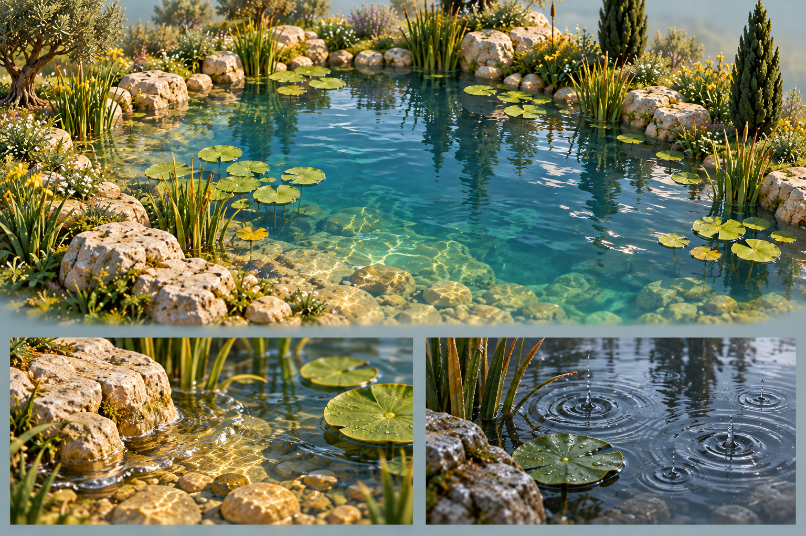
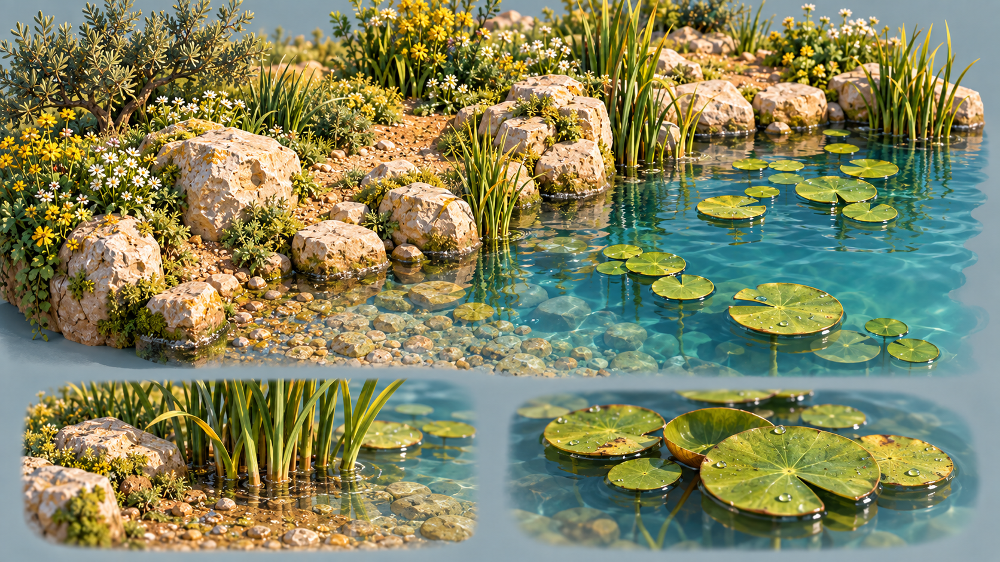
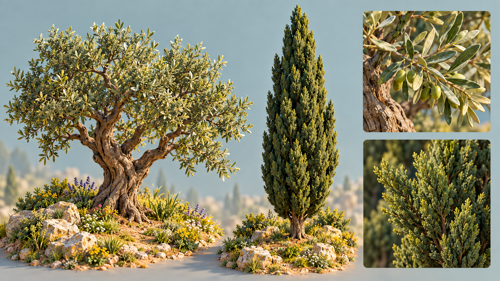
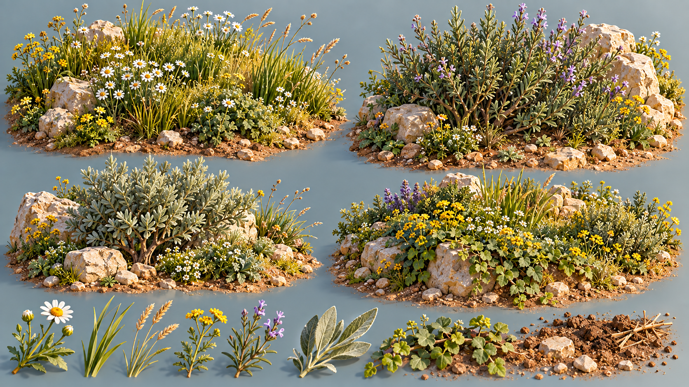
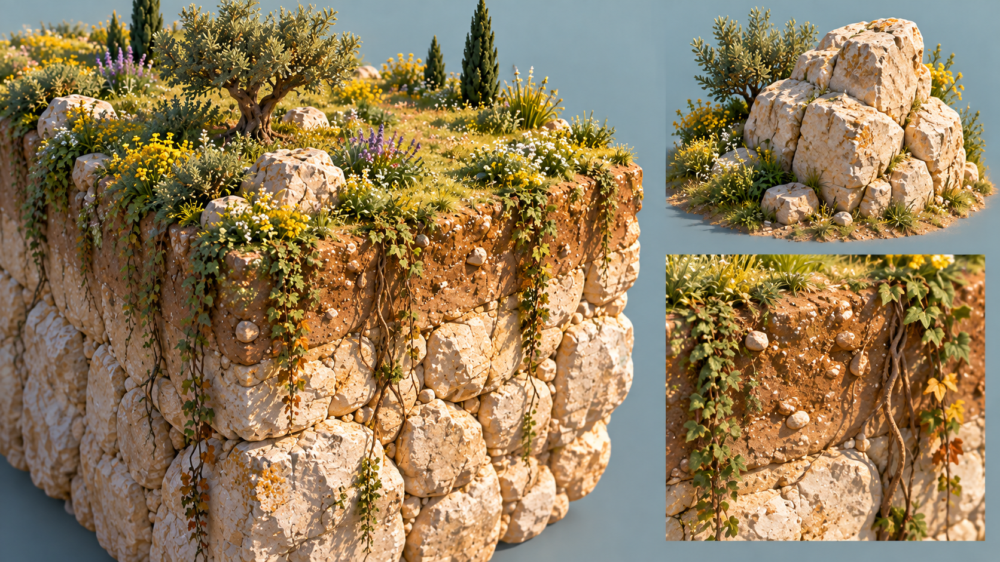
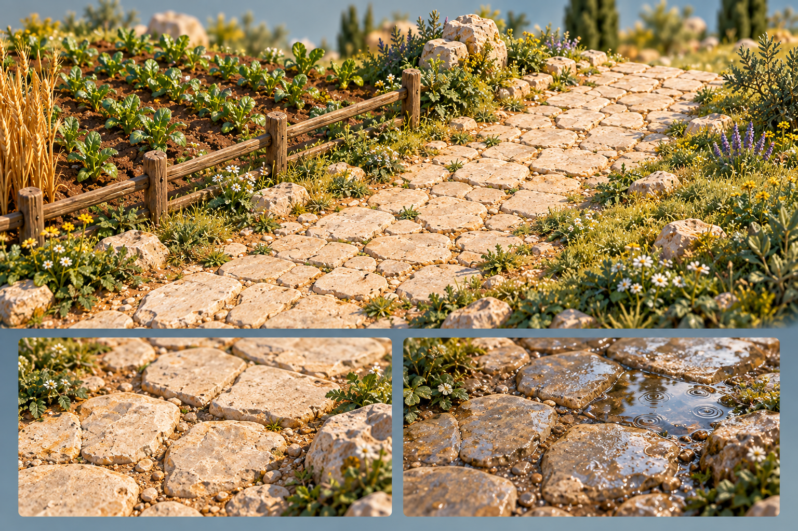

# Landscape detail references

Six supplementary concept sheets expand individual landscape pieces from the original Little Rome town art. Generated with the built-in image tool on 2026-09-26, using the original summer, spring, autumn and winter images as direct style/material references. These are concept illustrations, not captures of the running game.

The six original town concepts remain the overall visual targets. This set preserves their warm handcrafted miniature direction while making small surfaces, foliage and transitions easier to inspect. It introduces no gameplay rules or additional construction tools. Winter details show wet weather rather than snow or ice.

Exact prompts and the reference paths for each sheet are recorded in [prompts.json](prompts.json). Original generated-output paths, dimensions and file hashes are recorded in [manifest.json](manifest.json).

| Sheet | Detail focus |
| --- | --- |
| [01 — Pond water](01-pond-water-v1.png) | Clear shallows, deeper teal water, reflected foliage, overlapping ripples, summer glints and winter rain-impact rings. |
| [02 — Pond shore](02-pond-shore-v1.png) | Partly submerged stone, damp sediment, pebbles, moss, reeds, lily-pad edges and the waterline. |
| [03 — Olive and cypress](03-olive-and-cypress-v1.png) | Tree silhouettes, branching, bark, root contact, silver-green olive leaves and layered cypress sprays. |
| [04 — Groundcover and herbs](04-groundcover-and-herbs-v1.png) | Grass blades, branching herbs, low shrubs, wildflowers, soil gaps and mixed planting clusters. |
| [05 — Cliff, rock and soil](05-cliff-rock-and-soil-v1.png) | Fractured limestone, soil cap, roots, uneven grassy rim, mineral variation and trailing vegetation. |
| [06 — Paths and field borders](06-paths-and-field-borders-v1.png) | Worn irregular paving, joints and grit, cultivated soil, simple fence details, dry and wet surfaces. |

## Pond water

## Pond shore

## Olive and cypress

## Groundcover and herbs

## Cliff, rock and soil

## Paths and field borders

